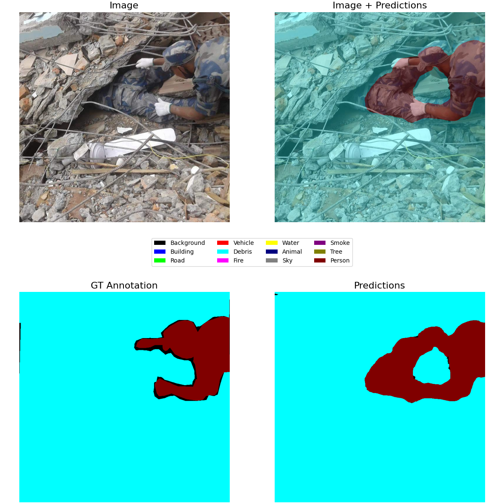
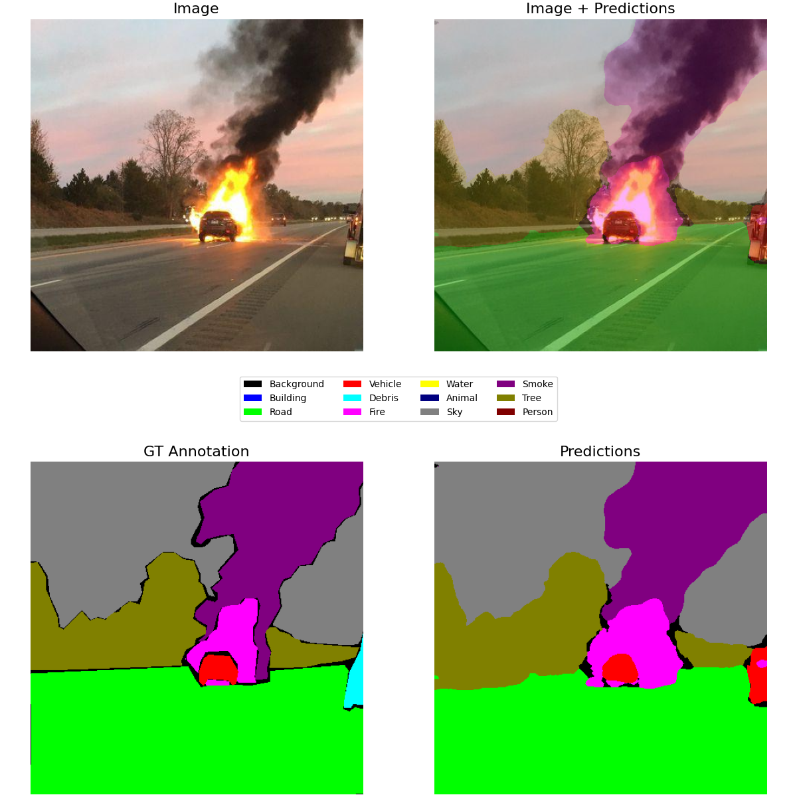
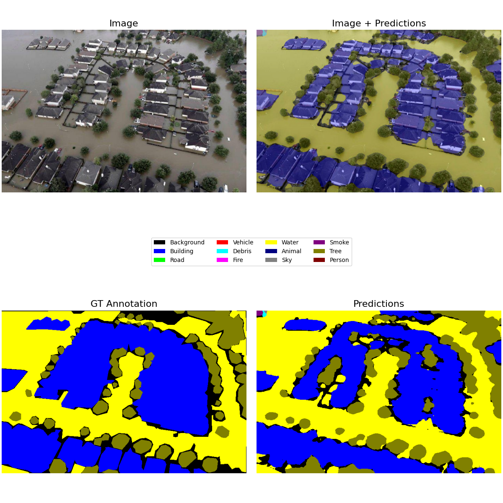
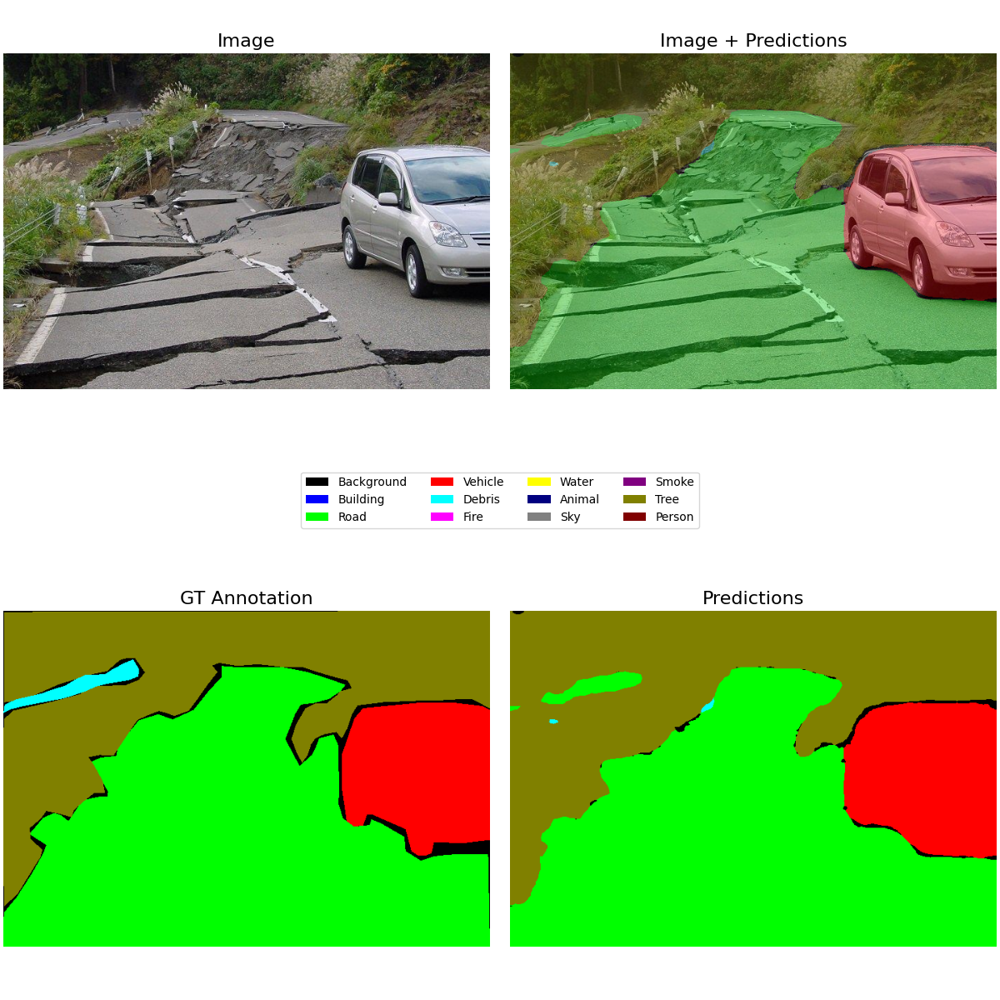

# Semantic Image Segmentation for Search-and-Rescue Scenarios Using Deep Learning and Attention Mechanisms

random augmentation examples

## Learning Curves

## Examples

### Earthquake

### Fire

### Flood

### Infrastructure

