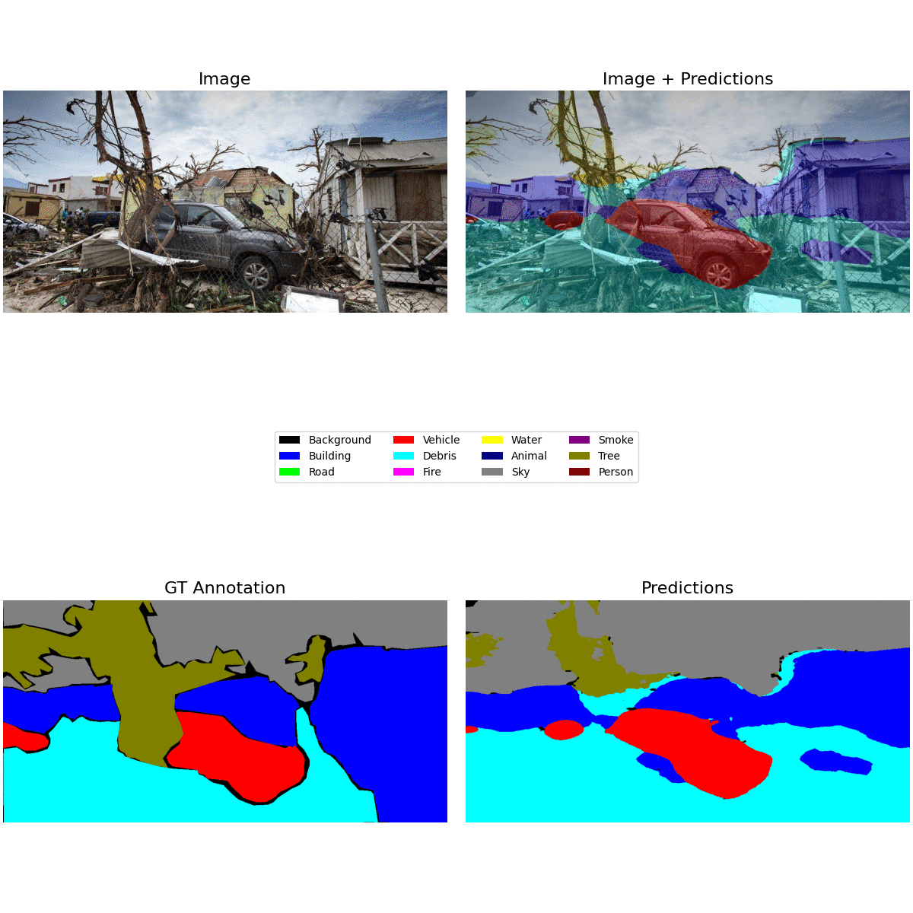
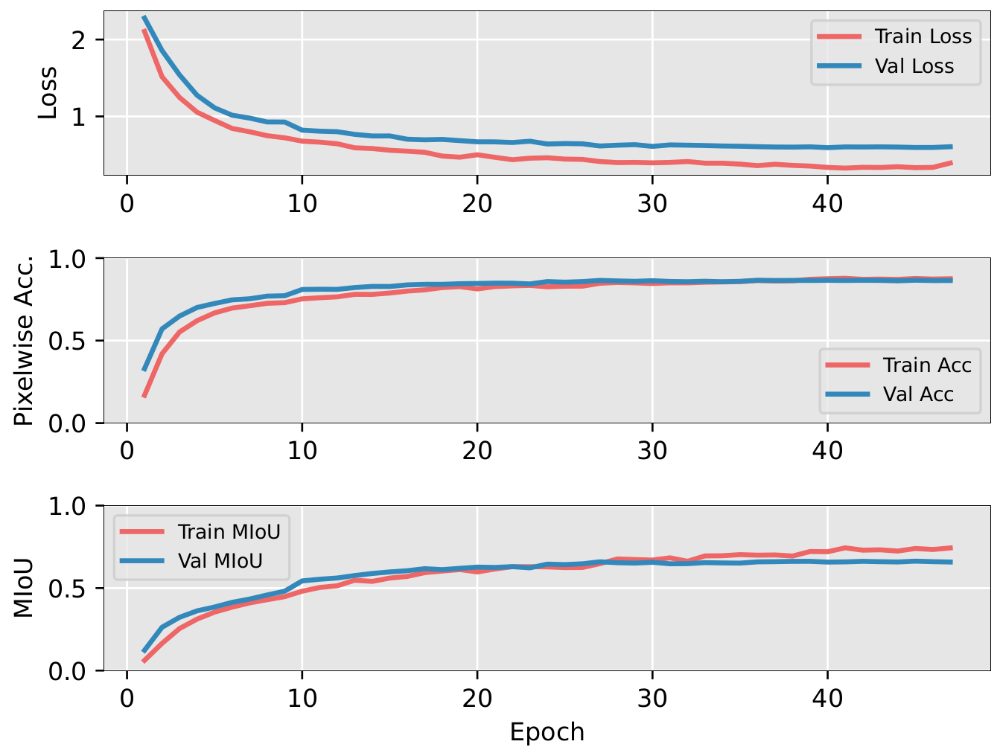

# Semantic Image Segmentation for Search-and-Rescue Scenarios Using Deep Learning and Attention Mechanisms

## Learning Curves

## Acknowledgements

- [SegFormer](https://github.com/NVlabs/SegFormer)
- [Grounded-Segment-Anything](https://github.com/IDEA-Research/Grounded-Segment-Anything)
